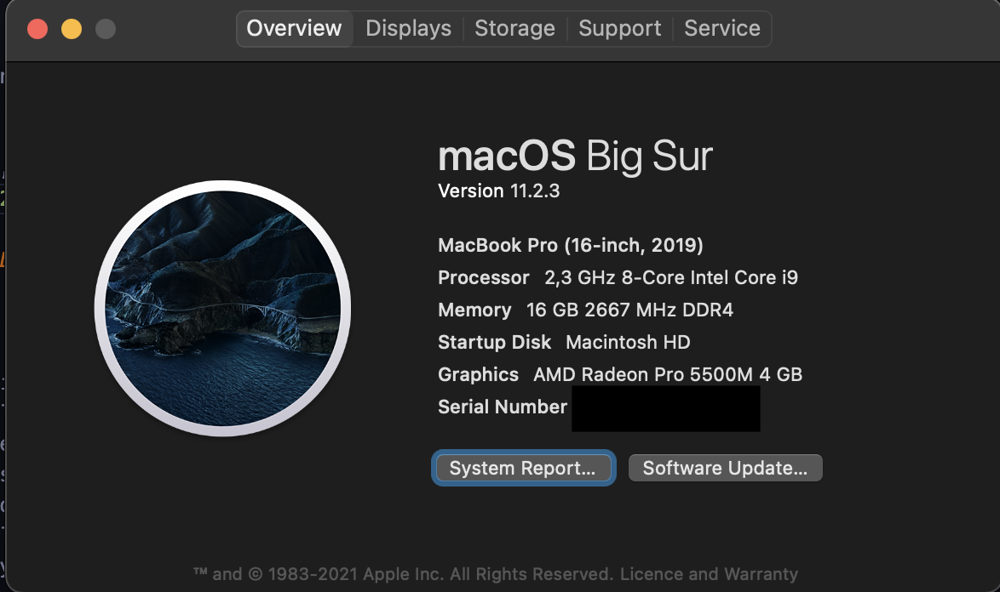

# ChannelProcessingSystem
## Data ingestion
In order to feed data into the solution, we take as formatting rules the ones applied in the .txt provided as per data so that the solution is general enough to accept different variables in the same file whenever they follow the formatting rules of the files provided.
## Persistence of the metrics calculated
Metrics calculated have been stored in both the original format, JSON and CSV. The original format is considered since it is the format that other software in the ecosystem may use per input. JSON is added since it is one of the most popular formats to ingest data into systems as well as CSV is. The latter also can be imported into Excel for data visualization and presentation.
All processed files can be found under `./data/processed/` directory
## Value of the metric 'b'
As per requested in the assignment, the value of the metric 'b' can be found in the parameters export. The value obtained in floating point by python (floating point calculation errors may need to be considered) is `6.269852166777007`

# Performance Analysis
After implementing the solution a performance report is generated to provide an idea of the execution time expected.  
In order to analyse the performance, the execution time of the different parts of the code have been timed, tagged and collected into a CSV to then generate the performance metrics. This collection introduces an overhead and more complexity to the code but any performance analysis does. In the production code this analysis wouldn´t execute but in order for the reader to see the process, the code has been left in the files.
For the analysis to be statistically significative, 30 executions were performed [1].
## Hardware
The execution of the solution has been performed in a machine with the following system:

## Metrics data
Data extracted from the metrics can be found under `./data/performance/performance_metrics.csv` in case the reader would like to see the metrics extracted.

### Performance Report

# Ideas to expand the solution.
In order to generalize the solution, a solution where the ecuations could be serialised in a file, deserialised, and calculated in order could be implemented.
This expansion would allow the users to store the equations in a human-readable format (i.e. .txt).
The .txt would be read and the solution would discover which variables would be missing for each equation.
If an equation could be calculated, the solution would calculate and append to channels or parameters the results (would depend on the casing).
The solution would iterate over the different equations and would solve if solvable.
The solution would be escalable since the worst case scenario would have complexity **O(n*n/2+0.5n)** which is below O(n**2)
Without extra feedback on the use case and focusing only in the details provided in the document, this expansion is considered over-engineering and therefore, although some time has been dedicated to put the expansion in perspective and think about it, in the end has not been implemented.
# References
[1] Hogg, R. V., Tanis, E. A., & Zimmerman, D. L. (1977). Probability and statistical inference (Vol. 993). New York: Macmillan.